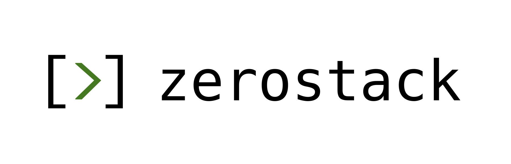

<p align="center">
  
</p>

# mini-agent

**A small Rust coding agent that can use JavaScript as a safe, portable action language—and learn
better JavaScript tools for the work it repeatedly encounters.**

mini-agent starts from [ZeroStack](https://github.com/gi-dellav/zerostack), whose design gets the
foundation right: a compact native agent, a fast terminal UI, strong permission controls, multiple
model providers, persistent sessions, MCP, worktrees, subagents, prompts, memory, and automation
without the runtime footprint of an Electron or Node application. mini-agent keeps that deliberately
small core and adds a brokered QuickJS engine, native Linux/macOS/Windows containment, and a verified
library of reusable agent-authored JavaScript skills.

The result is still a practical coding agent, but its action space is no longer limited to a pile of
one-off shell commands.

## Why ZeroStack is the right foundation

ZeroStack proves that a capable coding agent does not need to be a large desktop application. Its
upstream project reports roughly **30k core lines of Rust**, a **26 MB binary**, about **16 MB average
RAM / 24 MB peak RAM**, **0% idle CPU**, and approximately **1.5% CPU while using tools** on its
reference machine. Those are upstream measurements rather than mini-agent benchmarks, but they
capture the design priority mini-agent preserves: spend resources on the model and the task, not on
the agent shell.

Just as importantly, ZeroStack already provides the everyday product around the agent loop:

- OpenRouter, OpenAI, Anthropic, Gemini, Ollama, and custom providers
- a responsive terminal UI plus headless one-shot operation
- configurable permissions and session-scoped approvals
- saved sessions, compaction, prompts, memory, and context files
- MCP, subagents, Git worktrees, long-running loops, hooks, LSP, and ACP feature flags
- a native Rust binary with near-zero idle overhead

mini-agent is an extension of that philosophy, not a replacement for it: keep the excellent minimal
host, then give the agent a more expressive and portable way to act.

Upstream ZeroStack's README currently labels Windows support as untested. mini-agent's most important
architectural departure is to stop treating a Unix shell as the universal action substrate: the
portable JS contract is tested on Linux, macOS, and Windows, with a native containment adapter for
each.

## What mini-agent adds

| Addition | Why it matters |
|---|---|
| JavaScript as a tool | The model can filter, transform, branch, loop, and combine results in one bounded program instead of emitting many fragile tool calls. |
| QuickJS, not a Node sidecar | The JavaScript engine is small and embeddable; there is no package manager, module loader, or background Node service. |
| One cross-platform action contract | The same JavaScript and typed effects are available on Linux, macOS, and Windows. OS-specific code is confined to launch and containment. |
| Parent-owned capability broker | JavaScript cannot directly open the filesystem, network, or processes. Every real effect is typed, narrowed, permission-checked, audited, and executed by Rust. |
| Fresh runtimes | Every step and every complete verification request receives a new bounded QuickJS runtime. No JavaScript heap survives between requests. |
| Curated skill library | The agent can propose useful JavaScript snippets, verify them, retrieve them by meaning, and improve the library from attributable evidence. |
| Evidence-based lifecycle | Skills can progress through proposal, verification, human-gated canary, promotion, quarantine, repair, supersession, and rollback. |

## Code as tool

Traditional agents choose one tool call at a time. That works for simple operations, but orchestration
quickly moves into the model's token stream: call a tool, inspect text, decide, call another tool,
repeat. Control flow is implicit, intermediate data is repeatedly serialized, and each round trip is
another opportunity to lose intent.

Code-as-tool gives the model a small program as its action:

```js
const manifest = JSON.parse(read_file("package.json"));
const internal = Object.entries(manifest.dependencies ?? {})
  .filter(([name]) => name.startsWith("@acme/"))
  .map(([name, version]) => ({ name, version }));

console.log(JSON.stringify(internal));
```

That program can express composition, conditionals, loops, parsing, aggregation, and retry decisions
directly. Apple's [CodeAct research](https://machinelearning.apple.com/research/codeact) describes
the same core advantage: executable code creates a unified action space in which an agent can compose
tools and revise its action from execution feedback; the paper reports gains of up to 20% on its
evaluated tasks.

In mini-agent, “code as tool” does **not** mean arbitrary ambient authority. The JavaScript language
handles computation; Rust retains effects. `read_file`, `write_file`, `fetch`, `spawn`, and
`propose_skill` are capability-brokered operations with explicit grants. There is no `require()`,
`import()`, or direct network/filesystem API.

## JavaScript as the cross-platform feature

Shell is not one language across operating systems. Bash, PowerShell, executable lookup, quoting,
signals, path syntax, and sandbox primitives all differ. A Bash-first action design therefore makes
one platform canonical and the others compatibility ports.

JavaScript changes where that portability boundary sits:

```text
the same JS program
        │
        ▼
the same typed effect protocol
        │
        ├── Linux  → bubblewrap worker + Rust broker
        ├── macOS  → Seatbelt guardian + Rust broker
        └── Windows→ LPAC/AppContainer + Job + Rust broker
```

[QuickJS](https://bellard.org/quickjs/) is a particularly good fit: its official project describes a
small embeddable engine with modern ECMAScript support, fast runtime startup, and near-complete
Test262 conformance. The agent writes one standardized language; mini-agent implements the platform
differences below the effect contract.

Feature parity comes from four things together—not from JavaScript alone:

1. one JavaScript ABI and wire protocol;
2. one parent-side capability and permission model;
3. one behavioral test matrix for all three targets; and
4. platform-native containment that fails closed when its attestation is unavailable.

| Contract | Linux | macOS | Windows |
|---|---|---|---|
| JavaScript semantics and limits | QuickJS | QuickJS | QuickJS |
| Typed file/fetch/process/proposal effects | Same broker contract | Same broker contract | Same broker contract |
| Fresh runtime per request | Yes | Yes | Yes |
| No ambient worker workspace, credentials, or network | Enforced empty-root `bwrap` profile | Deny-default Seatbelt one-time image on validated macOS 26 hosts | LPAC/AppContainer token, handle, and Job attestation |
| Uncontained production fallback | Never | Never | Never |

The core JS feature contract is equal; high-authority operations remain available only when their
platform backend can prove the required guarantee. Linux's worker profile is enforced by namespaces
and seccomp. macOS uses Apple's deprecated Seatbelt interface and is therefore labeled
`DeprecatedBestEffort`, even though every launch runs the full live denial matrix. Windows uses
LPAC/AppContainer and Job objects, whose ambient filesystem visibility still depends partly on host
ACLs; learned-skill process spawning remains disabled there until an immutable-executable backend
exists. If a required backend or live proof fails, that capability—or JavaScript itself—is
unavailable instead of silently running with more authority.

See [the architecture overview](ARCHITECTURE.md) and
[brokered runtime specification](docs/specs/phase-6-brokered-js-runtime.md) for the exact threat
model.

## An agent-curated library of JavaScript tools

The deeper idea is not merely “let the model run JavaScript.” It is to let the agent turn repeated
problem-solving work into a small, local, verified tool library.

Suppose the agent repeatedly needs to inspect Cargo metadata, normalize test output, compare API
schemas, or summarize dependency graphs. The first time, it writes task-specific JavaScript. When a
pattern is general enough to reuse, it may propose a named skill containing:

- source code and exported functions;
- a natural-language description and retrieval tags;
- exact capability scopes, such as read access limited to `src/`;
- ordered JavaScript tests that must evaluate to the boolean `true`; and
- ABI and lineage metadata.

The lifecycle is deliberately curatorial:

```text
repeated task
    → propose immutable JS skill
    → verify in fresh no-effect runtimes + held-out Rust cases
    → human-approved, non-retrievable canary
    → evidence-based promotion
    → semantic retrieval for a relevant future prompt
    → attributed success or failure evidence
    → retain / quarantine / repair / supersede / roll back
```

This follows the useful part of the
[Voyager skill-library idea](https://voyager.minedojo.org/): code represents temporally extended,
composable behavior; descriptions make skills retrievable; and new programs can build on simpler
ones. mini-agent adapts that pattern for coding work and adds stricter admission and authority
boundaries.

Every learned skill is content-addressed. Identity version 2 hashes the full canonical payload—not
just source—including tests, discovery metadata, ABI version, exports, and structured capability
scopes. Changing a test or widening a path therefore creates a different immutable artifact. The
worker never reads the skill database, and retrieved skills receive only their declared capabilities.

This is **bounded self-improvement**, not uncontrolled self-modification:

- proposing a skill cannot execute or activate it;
- verification has deterministic fakes and fresh runtime state;
- human approval is required before the initial canary;
- write, process, and network authority keep their human gates;
- production evidence must be directly attributable to the exact skill revision;
- failures can quarantine a revision without deleting its audit history; and
- repair creates a new immutable revision, so rollback never means guessing what changed.

Over time, the agent spends fewer tokens rediscovering reliable transformations and gains
domain-specific tools shaped by the repository it actually works in. The library becomes a compact
record of executable know-how rather than a growing prompt full of prose recipes.

## Quick start

Install the latest checksum-verified release on Linux or macOS:

```bash
curl -fsSL https://raw.githubusercontent.com/sebahrens/mini-agent/main/install.sh | bash
```

Or install with Cargo:

```bash
cargo install mini-agent
```

Configure a provider interactively, then start a session:

```bash
mini-agent --setup
mini-agent
```

OpenRouter is the default provider and can also be configured directly:

```bash
export OPENROUTER_API_KEY="sk-or-v1-..."
mini-agent -p "Explain this repository's architecture"
```

See [Getting started](docs/agent/GET_STARTED.md),
[provider configuration](docs/agent/PROVIDERS.md), and
[the complete configuration reference](docs/agent/CONFIG.md).

## Feature flags

The default build includes the core ZeroStack experience plus `js`, `sandbox`, and `memory`.
Learned-skill storage is opt-in because it adds SQLite and retrieval dependencies.

| Feature | Adds |
|---|---|
| `js` | Brokered QuickJS worker and parent-owned effect globals |
| `sandbox` | Linux/macOS/Windows process isolation and brokered `spawn`/`fetch` where supported |
| `skills` | Immutable learned-skill store, deterministic embeddings, retrieval, verification, and lifecycle; implies `js` |
| `skills-embed` | Local BGE embedding inference through ONNX Runtime |
| `skills-embed-dynamic` | Runtime ONNX linkage for hosts without a prebuilt `ort-sys` binary |
| `memory` | Persistent project and user memory |
| `mcp` | MCP client transports and tool discovery |
| `acp`, `hooks`, `lsp`, `advisor`, `multimodal`, `pdf` | Optional integrations inherited from and built around the ZeroStack core |

For the full feature graph, see [Cargo.toml](Cargo.toml).

## Architecture and specifications

Production QuickJS never exists in the trusted parent process. The parent lazily supervises at most
one contained same-executable worker, creates an immutable grant table for each invocation, and
executes every external effect itself. The worker creates and drops a fresh 64 MiB-heap,
512 KiB-stack runtime for every step or complete verification request. Transport, protocol,
deadline, cancellation, resource, or containment faults recycle the worker and revoke the invocation.

The normative design is split by concern:

- [Specification index](docs/specs/00-index.md)
- [Core JavaScript engine](docs/specs/phase-1-js-engine.md)
- [Sandboxing and brokered effects](docs/specs/phase-2-sandbox.md)
- [Skill library and retrieval](docs/specs/phase-3-skill-library.md)
- [Proposal and admission](docs/specs/phase-4-auto-admission.md)
- [Evidence learning, quarantine, and rollback](docs/specs/phase-5-evidence-learning.md)
- [Contained worker and capability broker](docs/specs/phase-6-brokered-js-runtime.md)
- [Subprocess trust classes](docs/specs/subprocess-trust.md)

`ARCHITECTURE.md` and `SPEC.md` are maintained overviews; the indexed phase documents are normative.

## Development

Run production commands from the repository root:

```bash
cargo fmt
cargo test
cargo install --path . --debug
```

The separate `spike/` workspace is retained only for QuickJS research and is never a production
target. Do not use `cargo build`, `cargo check`, or development `--release` builds in this repository.

## License and upstream

mini-agent is licensed under [GPL-3.0-only](LICENSE). It is built from the excellent
[ZeroStack](https://github.com/gi-dellav/zerostack) project and preserves its preference for a small,
fast, understandable native agent.
