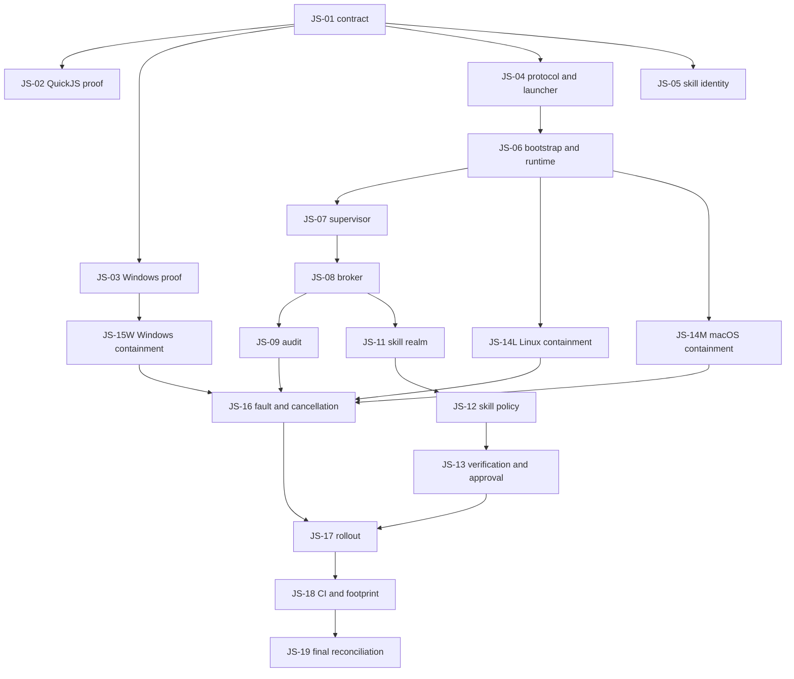

# refactor: Package open Beads work for code-agent handoff

## Overview

Package the 60 open Beads records into dependency-safe code-agent assignments. The two epics (`mini-agent-xic0` and `mini-agent-7r1a`) remain roll-up records and are not assigned as implementation work; the 58 child and standalone issues are assigned through the bundles below.

The default assignment is one worktree/branch per bundle, one agent at a time within that bundle, and no more than three issues per bundle. A bundle is an ordered queue, not one combined change: the agent keeps each bead independently reviewable and closes it only when its own acceptance criteria pass.

## Problem Frame

Handing all ready issues to independent agents would create avoidable collisions in `src/extras/js/`, `src/sandbox.rs`, `src/agent/runner.rs`, and session persistence code. Conversely, handing an entire epic to one agent would create a branch too large to review or recover. The assignment model must preserve hard Beads dependencies, add soft serialization around shared files, and keep security-sensitive changes small enough for focused review.

## Requirements Trace

- R1. Every open non-epic bead appears in exactly one bundle, except `mini-agent-04n3`, whose acceptance is explicitly absorbed and closed with `mini-agent-xic0.12`.
- R2. No bundle begins until all hard Beads blockers outside that bundle are closed.
- R3. Issues sharing mutable core files are owned by the same agent or serialized, even when Beads does not encode that ordering.
- R4. Each bundle contains at most three issues; large security or platform boundaries remain singletons.
- R5. Each agent follows the current repository `AGENTS.md`; stale command or workflow text in older issue bodies does not override it.
- R6. Each bead retains its own tests, acceptance decision, close operation, and atomic commit boundary.

## Scope Boundaries

- This plan groups and sequences existing work; it does not change issue descriptions, dependencies, priorities, or implementation scope.
- The two epic records are tracking containers, not code-agent assignments.
- Parallelism means separate worktrees and non-overlapping bundles; it does not authorize simultaneous edits to the same shared files.
- This plan does not prescribe exact implementation code.

## Context & Research

### Relevant Code and Patterns

- `docs/superpowers/plans/2026-08-01-brokered-js-runtime.md` defines the brokered-JS architecture and its implementation order.
- `Cargo.toml` defines a Rust 2024 workspace with feature-gated JS, skills, sandbox, memory, MCP, hooks, and LSP surfaces.
- `src/extras/js/` is the main high-collision area for `mini-agent-xic0.*`.
- `src/sandbox.rs` and subprocess clients are shared by `mini-agent-7r1a.*`, `mini-agent-qmrn`, `mini-agent-8tbo`, and `mini-agent-uq5c`.
- `src/agent/runner.rs` is shared by `mini-agent-2fl` and `mini-agent-rio`.
- `src/ui/slash/session.rs`, `src/ui/event_handler.rs`, and `src/session/` form the session mutation/import boundary.

### Institutional Learnings

- No `docs/solutions/` knowledge base or `critical-patterns.md` exists in this repository.
- Existing issue bodies consistently require focused tests, full `cargo test`, debug installation, and real-binary checks where user-visible behavior changes.

### External References

- None. This is assignment packaging from authoritative local dependencies and specifications, not a new security or platform design.

## Key Technical Decisions

| Decision | Rationale |
|---|---|
| Cap bundles at three beads | Keeps context and review size bounded while still amortizing repository discovery. |
| Treat the JS spine as sequential | Protocol, worker, supervisor, broker, audit, and tool migration repeatedly touch the same modules. |
| Parallelize platform launchers only after the common worker contract | Linux/macOS and Windows can then implement one stable interface without divergent scaffolding. |
| Put absorbed work in the owning bundle | `mini-agent-04n3` must close with `mini-agent-xic0.12`, avoiding a competing permission-subject design. |
| Use soft ordering for subprocess consumers | The current graph permits them concurrently, but landing the shared bounded-runner seam first reduces duplicated helpers and merge conflicts. |

## Handoff Protocol

Each code agent receives:

1. The bundle ID and ordered bead IDs.
2. The instruction to run `bd show` for every bead, then claim and execute one bead at a time only after its external blockers close.
3. A dedicated worktree/branch, with each bead kept independently reviewable.
4. The current `AGENTS.md` compilation, test, Beads close, commit, sync, and push rules.
5. A stop condition: if implementation reveals a scope conflict between beads, finish the currently valid bead and report the remaining bead instead of silently widening scope.

Beads mutations require their own coordination lane. This project uses embedded Dolt in single-writer mode, so claims, updates, closes, and Dolt synchronization must be serialized even while code/test work runs in parallel. Agents must use ordinary project `bd` commands and must never start a Dolt server. Before dispatch, the coordinator confirms the claim centrally; at completion, only one agent at a time updates/closes tracker state.

## Bundle Dependency Graph

The prose and bundle tables are authoritative; this graph summarizes the major fan-out and fan-in points.

## Implementation Units

### Unit 1: Independent stabilization bundles

These bundles are initially ready, but only bundles without an ordering note should run in parallel. They should land early to reduce noise before the cross-cutting epics.

| Bundle | Ordered beads | Primary files | Test scenarios |
|---|---|---|---|
| `STAB-01` Context-fence and memory correctness | `mini-agent-n6ct`, `mini-agent-g02d`, `mini-agent-8qrk` | `src/extras/js/skills/turn.rs`, `src/extras/memory/mod.rs`, `src/ui/slash/memory.rs`, corresponding JS/memory tests | Literal closing fences remain inside their trust region; dated daily reads use the requested safe date and reject traversal. |
| `STAB-02` CI feature reliability | `mini-agent-jygu`, `mini-agent-5eko`, `mini-agent-gqq` | `Cargo.toml`, `Cargo.lock`, `.github/workflows/ci.yml`, `src/tests/todo_tests.rs` | Supported feature rows compile/test explicitly; optional dependencies disappear when disabled; repeated parallel todo tests do not race; the feature-plumbing gate closes last. |
| `STAB-03` Session import/export safety | `mini-agent-u14w`, `mini-agent-r2cu` | `src/ui/slash/session.rs`, `src/extras/export.rs`, session/export tests | Native JSON and JSONL dispatch correctly; malformed input is bounded; exported attacker-controlled HTML is inert while normal Markdown survives. |
| `STAB-04` Session mutation durability | `mini-agent-9zt0`, `mini-agent-9g1i` | After `STAB-03`: `src/ui/slash/session.rs`, `src/ui/event_handler.rs`, `src/ui/app.rs`, `src/session/`, session tests | Clear/undo/redo persist atomically; failed turns are rolled back before persistence; disk and memory agree after failure/restart. |
| `STAB-05` Agent stream state machine | `mini-agent-2fl`, `mini-agent-rio` | `src/agent/runner.rs` and colocated/runner tests | Nonterminal EOF consumes a finite budget; parallel/out-of-order tool results correlate by call ID; terminal and normal tool flows remain unchanged. |
| `STAB-06` Plan-write authorization | `mini-agent-4gom` | `src/permission/checker.rs`, `src/tests/checker_tests.rs`, filesystem safety tests | In-root plans work; external, sibling-prefix, traversal, symlink, nonexistent-parent, and replacement-race cases cannot gain PlanWrite privilege. |
| `STAB-07` JS fetch bounds | `mini-agent-6qry`, `mini-agent-vbnv` | JS host/effect fetch code and JS network tests | Whole fetch calls time out; repeated DNS timeouts have bounded live work; no destination I/O precedes SSRF validation; recovery succeeds. |

**Verification:** Every bead's focused scenarios and the repository quality gates pass independently; no bundle closes a bead merely because a sibling bead passed.

### Unit 2: Non-JS subprocess trust and shared runner

Run the following in order. `PROC-04`, `PROC-05`, and `PROC-06` may run in parallel after `PROC-02` lands. This is a soft serialization rule beyond the current Beads graph.

| Bundle | Ordered beads | External prerequisite | Primary files and scenarios |
|---|---|---|---|
| `PROC-01` Trust inventory | `mini-agent-7r1a.1` | None | `docs/specs/subprocess-trust.md`, `docs/specs/00-index.md`, inventory check. Every production subprocess launch is classified and new unclassified sites fail the check. |
| `PROC-02` Explicit and loop commands | `mini-agent-7r1a.5`, `mini-agent-qmrn` | `PROC-01` | `src/sandbox.rs`, `src/startup.rs`, `src/ui/app.rs`, loop headless/TUI paths. Success, failure, timeout, flood, cancellation, descendant cleanup, cwd, and TUI/headless parity use one bounded seam. |
| `PROC-03` Worktree subprocesses | `mini-agent-8tbo` | `PROC-02` | `src/extras/git_worktree/mod.rs`, worktree tests. Concurrent repositories never mutate process-global cwd; slow/flooding Git is bounded and cancellable. |
| `PROC-04` Project hooks | `mini-agent-7r1a.2` | `PROC-02` | Hook subprocess/config/docs/tests. Cwd, minimal env, explicit trust, requested-sandbox failure, cancellation, and descendant cleanup match the trust contract. |
| `PROC-05` MCP stdio | `mini-agent-7r1a.3` | `PROC-02` | MCP client/config/tests. Initialization, framing/stderr, env/cwd, cancellation/drop, descendant cleanup, and reconnect are bounded. |
| `PROC-06` LSP lifecycle | `mini-agent-7r1a.4` | `PROC-02` | LSP client/RPC/config/tests. Frames/stderr, initialization, pending requests, teardown, restart, cwd, env, and sandbox status are bounded and truthful. |
| `PROC-07` General Windows sandbox | `mini-agent-uq5c`, `mini-agent-z2mh` | `PROC-02` and `JS-15W` | `src/sandbox.rs`, `src/cli.rs`, Windows CI, README/config/sandbox docs. Restricted-token/Job containment permits workspace writes, denies outside writes, kills descendants, reports actual capabilities, then documentation reflects the delivered default-on behavior. |

**Verification:** Each consumer exercises its own trust class. The broker-only JS worker profile is never reused for workspace-capable MCP, LSP, hooks, worktrees, or explicit user shell commands.

### Unit 3: Brokered-JS foundation

| Bundle | Ordered beads | External prerequisite | Primary files and scenarios |
|---|---|---|---|
| `JS-01` Normative contract | `mini-agent-xic0.1` | None | Phase-6 spec and index. Threat model, protocol, effect ordering, platform containment, migration, and fail-closed behavior are normative and internally consistent. |
| `JS-02` QuickJS proof and feature surface | `mini-agent-xic0.2`, `mini-agent-xic0.4` | `JS-01`; `mini-agent-xic0.4` additionally waits for `STAB-02` | QuickJS realm tests, `Cargo.toml`, `Cargo.lock`. Cross-context isolation assumptions are proved; require/import/module loading remain absent under minimal features. |
| `JS-03` Windows feasibility proof | `mini-agent-xic0.3` | `JS-01` | Windows spike/CI evidence. Supported install locations can launch the LPAC worker image or fail closed with a precise unsupported result. |
| `JS-04` Protocol and launcher contract | `mini-agent-xic0.5`, `mini-agent-xic0.6` | `JS-01` | JS protocol tests and `src/sandbox/worker*`. Hostile frames, ordering, limits, unavailable backends, owned pipes, and teardown obey closed contracts. |
| `JS-05` Skill identity foundation | `mini-agent-xic0.19` | `JS-01` | Skill manifest/store/migration tests. ABI-v2 identity includes structured scopes; v1 is quarantined and mutation changes identity. |

`JS-02`, `JS-03`, `JS-04`, and `JS-05` may start in parallel after `JS-01` lands. Within `JS-02`, close `mini-agent-xic0.2` first; `mini-agent-xic0.4` waits for `STAB-02` because both edit the Cargo feature graph.

### Unit 4: Worker and broker spine

This unit is deliberately serialized because every bundle builds on and edits the same worker transport path.

| Bundle | Ordered beads | Prerequisite | Primary files and scenarios |
|---|---|---|---|
| `JS-06` Bootstrap and fresh runtime | `mini-agent-xic0.7`, `mini-agent-xic0.8` | `JS-04` and `JS-02` | `src/main.rs`, JS worker/runtime/tests. Worker bootstrap occurs before normal initialization; every request gets a fresh limited runtime; authority globals are absent unless provisioned. |
| `JS-07` Serialized supervisor | `mini-agent-xic0.9`, `mini-agent-xic0.10` | `JS-06` | JS supervisor/runtime tests. One owner serializes transport; watchdog, crash, cancellation, tree teardown, restart, and next-call recovery are deterministic. |
| `JS-08` Parent broker and effects | `mini-agent-xic0.11`, `mini-agent-xic0.12`, absorbed `mini-agent-04n3` | `JS-07`, `STAB-06`, and `STAB-07` | JS broker/host/tool tests. Parent-created grants authorize typed bounded effects; permission/path/network/process denials execute nothing; argv approval rendering is injective. |
| `JS-09` Durable audit | `mini-agent-xic0.13`, `mini-agent-xic0.14` | `JS-08` | JS audit/broker/path tests. Intent is private, hash-chained, synced before effects, corruption fails closed, and crash windows become `OutcomeUnknown`. |
| `JS-10` Tool migration | `mini-agent-xic0.15` | `JS-07`, `JS-08`, `JS-09` | JS tool/engine/builder/rebuild tests. Parent runtime/thread paths disappear, repeated agent builds reuse one stateless supervisor, and grants/config do not leak. |

### Unit 5: Learned-skill runtime and authorization

| Bundle | Ordered beads | Prerequisite | Primary files and scenarios |
|---|---|---|---|
| `JS-11` Private realms and capabilities | `mini-agent-xic0.16`, `mini-agent-xic0.17` | `JS-02`, `JS-05`, `JS-06`, `JS-08` | Skill realm/capability tests. Initialization is pure/private; capability objects expose only declared methods and revoke after settle/cancel. |
| `JS-12` Writer separation and scoped grants | `mini-agent-xic0.18`, `mini-agent-xic0.20` | `JS-09`, `JS-11`, `JS-08`, `JS-05` | Skill proposal/broker/policy tests. Persisted runners never receive writer authority; structured scopes intersect correctly across storage, loader, broker, and policy. |
| `JS-13` Verification and approval | `mini-agent-xic0.21`, `mini-agent-xic0.22`, `mini-agent-xic0.23` | `JS-11` and `JS-05` | Verification/held-out/admission/lifecycle tests. Production and verification share the loader contract; background work cannot delay interactive requests; approvals are parent-owned and one-time. |

`JS-12` and `JS-13` may run in parallel once their distinct prerequisites are met, but they should use separate worktrees because they may both touch skill lifecycle modules.

### Unit 6: Platform worker containment

| Bundle | Ordered beads | Prerequisite | Primary files and scenarios |
|---|---|---|---|
| `JS-14L` Linux containment | `mini-agent-xic0.24` | `JS-06` | Linux worker launcher and containment tests. No ambient workspace, credentials, network, or descendants; bwrap/seccomp/resource limits and teardown are empirically enforced. |
| `JS-14M` macOS containment | `mini-agent-xic0.25` | `JS-06` | macOS worker launcher and containment tests. Seatbelt, descriptor closing, rlimits, descendant cleanup, and the weaker/deprecated backend status are empirically truthful. |
| `JS-15W` Windows containment | `mini-agent-xic0.26`, `mini-agent-xic0.27` | `JS-03` and `JS-06` | Windows worker launcher/containment tests. LPAC, exact handles, creation-time Job, limits, install locations, ACL cases, and fail-closed status are proven on Windows. |

These bundles may run in parallel once their prerequisites close and each is assigned to an agent with the matching platform runner. The same Windows specialist should take `JS-15W` before the lower-priority `PROC-07`, reusing low-level process/Job lessons without conflating profiles: `JS-15W` provides the broker-only worker profile, while `PROC-07` later provides the general workspace-capable command sandbox.

## Open Questions

### Resolved During Planning

- **Should epics be handed to code agents?** No. Their child beads already define independently testable work, and assigning both would create duplicate ownership.
- **Should all ready beads run in parallel?** No. Readiness captures hard blockers but not shared-file conflicts; the soft orderings above govern dispatch.
- **Should absorbed `mini-agent-04n3` be implemented separately?** No. Its issue notes explicitly assign acceptance to `mini-agent-xic0.12`; `JS-08` owns its regression tests and closure.

### Deferred to Dispatch

- **How many agents run at once?** Use the available worktree, CI, and reviewer capacity; concurrency changes throughput but not bundle boundaries.
- **Who owns Windows-only bundles?** Select an agent with a Windows runner capable of exercising the issue's real containment probes; do not accept compile-only evidence.
- **Should soft ordering become Beads dependencies?** Encode it only if the team wants the tracker itself to prevent premature claims; this plan currently leaves Beads unchanged.

### Unit 7: Fault semantics and rollout

| Bundle | Ordered beads | Prerequisite | Primary files and scenarios |
|---|---|---|---|
| `JS-16` Faults and cancellation | `mini-agent-xic0.28`, `mini-agent-xic0.29` | `JS-08`, `JS-09`, `JS-14L`, `JS-14M`, `JS-15W` | Supervisor/broker fault-matrix tests. Each runtime/protocol/process/audit/cancel state has one truthful outcome, deterministic recycle decision, no leaks, and a successful next invocation. |
| `JS-17` Fail-closed rollout | `mini-agent-xic0.30` | `JS-10`, `JS-12`, `JS-13`, `JS-14L`, `JS-14M`, `JS-15W`, `JS-16` | Builder/startup/config/status tests. JS registers only when production containment works; `--no-sandbox` cannot authorize uncontained JS; status reports actual authority and reason. |

### Unit 8: Cross-platform evidence and closure

| Bundle | Ordered beads | Prerequisite | Primary files and scenarios |
|---|---|---|---|
| `JS-18` CI and resource evidence | `mini-agent-xic0.31`, `mini-agent-xic0.32` | `JS-17`, `STAB-02`, all platform bundles | CI/benchmark/docs. Supported feature/platform rows exercise the brokered architecture; reproducible idle/per-call memory, latency, and recycle evidence has bounded thresholds or explicit baselines. |
| `JS-19` Final spec reconciliation | `mini-agent-xic0.33` | Every other `mini-agent-xic0.*` child | Architecture/spec/status docs and checked inventories. No document claims the old in-process runtime or unsupported authority; delivered status and remaining limitations match tests. |

After `JS-19`, close `mini-agent-xic0` only when all children are closed. Close `mini-agent-7r1a` when its five `mini-agent-7r1a.*` children are closed; unfinished related standalone work such as `mini-agent-qmrn`, `mini-agent-8tbo`, or `mini-agent-uq5c` remains visible and is not hidden by epic closure.

## System-Wide Impact

- **Interaction graph:** Beads dependency state controls dispatch; worktree ownership controls file collisions; repository tests and real-binary checks control closure; CI/platform evidence controls final epic closure.
- **Error propagation:** A blocked or failed bead stops only its bundle and downstream bundles. Independent lanes may continue.
- **State lifecycle risks:** Agents must not close sibling beads together without independent acceptance evidence. Absorbed `mini-agent-04n3` is the sole intentional exception and still needs its explicit regression tests. Embedded-Dolt writes are serialized so parallel worktrees cannot race tracker state.
- **API surface parity:** Headless/TUI, enabled/disabled feature rows, and Linux/macOS/Windows paths remain explicit where the issue requires them.
- **Integration coverage:** Final JS rollout and CI bundles prove the fan-in that unit tests in earlier bundles cannot establish alone.
- **Unchanged invariants:** Current issue scope, Beads parent/child relationships, security contracts, and repository compilation rules remain authoritative.

## Risks & Dependencies

| Risk | Mitigation |
|---|---|
| Agents concurrently edit shared JS spine files | Serialize `JS-06` through `JS-10`; dispatch downstream skill/platform work only at stable contracts. |
| Subprocess agents create competing shared helpers | Land `PROC-02` before the consumer-specific bundles and require reuse of the established seam. |
| Session import and mutation bundles edit the same slash-command module | Land `STAB-03` before `STAB-04`. |
| Cargo feature work collides across stabilization and QuickJS minimization | Complete `STAB-02` before the `mini-agent-xic0.4` portion of `JS-02`; `mini-agent-xic0.2` need not wait. |
| Windows general and broker-only launchers duplicate Job/process primitives | Assign both sequentially to the same Windows specialist: land P0 `JS-15W` first, then P2 `PROC-07`, retaining distinct authority profiles. |
| Parallel agents contend for embedded Dolt's single writer | Serialize all claims, updates, closes, and synchronization through one coordination lane; never start a project-local or shared Dolt server for this repository. |
| A large bundle becomes unrecoverable | Three-bead maximum; singleton assignments for broad authorization, Windows backend, migration, and rollout boundaries. |
| Issue text and current repository instructions disagree | Every handoff states that current `AGENTS.md` wins. |
| Platform-specific work is claimed without a capable runner | Dispatch `JS-14L`, `JS-14M`, and `JS-15W` only with the corresponding Linux, macOS, or Windows verification runner available. |
| Epic closure hides unfinished canonical related work | Close epics from their child status only; report related standalone issues separately. |

## Documentation / Operational Notes

- This file is the dispatch map; Beads remains the lifecycle source of truth.
- Before each dispatch wave, rerun `bd ready` and `bd show` because newly closed blockers may change what is actionable.
- Serialize tracker writes even when code agents work concurrently; embedded Dolt is not a parallel coordination service.
- If desired, the soft ordering in `PROC-02` through `PROC-06` can be encoded as Beads dependencies in a separate tracker-maintenance change.

## Sources & References

- Brokered-JS architecture: `docs/superpowers/plans/2026-08-01-brokered-js-runtime.md`
- Repository rules: `AGENTS.md`
- Architecture: `ARCHITECTURE.md`
- Sandbox contract: `docs/specs/phase-2-sandbox.md`
- Issue source: open records reported by `bd list --status open` on 2026-08-01
