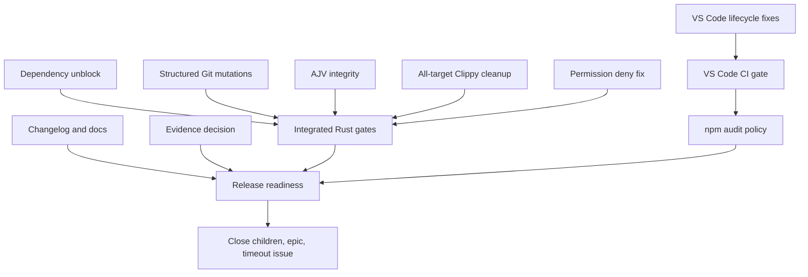

# fix: Resolve all v1.8.0 pre-release findings

## Overview

Resolve the complete `mini-agent-7t38` issue tree (R1-R12), close the timeout meta-issue
`mini-agent-4mgy`, and leave v1.8.0 with dependency, CI, lifecycle, permission, documentation,
and release-evidence findings either implemented or explicitly resolved under their stated
acceptance criteria.

## Problem Frame

The pre-release audit found one imminent release blocker and eleven lower-priority gaps across
the Rust crate, the VS Code extension, CI, dependency policy, and release documentation. The
previous automation loop timed out repeatedly on R1, so execution must use bounded issue-sized
units and verify each surface directly.

## Requirements Trace

- R1. Exercise the documented fallback after a real `rig-core` 0.42 compile probe: record the
  incompatible API split, renew the lopdf exception within the 90-day policy limit, and pass the
  dependency-policy and Rust gates (`mini-agent-7t38.1`).
- R2. Deliver stage, unstage, and commit as real structured Git operations with permission,
  containment, validation, and tests (`mini-agent-7t38.2`).
- R3. Run the VS Code extension's install, typecheck, lint, tests, and high-severity npm audit on
  ordinary CI (`mini-agent-7t38.3`, `mini-agent-7t38.7`).
- R4. Serialize chat and command session creation and invalidate in-flight creation on discard so
  no ACP process or status item is orphaned (`mini-agent-7t38.4`).
- R5. Make session-owned status items leave no retained extension subscription entry and verify
  lifecycle cleanup (`mini-agent-7t38.5`).
- R6. Add a user-facing 1.8.0 changelog and make changelog maintenance a release prerequisite
  (`mini-agent-7t38.6`).
- R7. Detect changes to the vendored AJV bundle through a source-integrity test
  (`mini-agent-7t38.7`).
- R8. Lint all Rust targets in every supported CI feature row and clear the resulting findings
  (`mini-agent-7t38.8`).
- R9. Remove the unreachable VS Code trust-revocation callback and misleading API claim
  (`mini-agent-7t38.9`).
- R10. Document the complete structured Git permission surface (`mini-agent-7t38.10`).
- R11. Explicitly document that v1.8.0 ships with honest pending external Phase 6 evidence rather
  than fabricating or carrying forward measurements (`mini-agent-7t38.11`).
- R12. Apply explicit deny rules before the `todo_write` convenience allowance, with regression
  tests (`mini-agent-7t38.12`).
- R13. Verify R1 manually and close the repeated-timeout meta-issue (`mini-agent-4mgy`).

## Scope Boundaries

- Do not update the vendored AJV version; enforce the currently documented bundle identity.
- Do not invent Phase 6 measurements or reuse 1.7.2 data for the 1.8.0 package version.
- Do not add direct worker network/filesystem access or weaken existing Git sandbox and permission
  boundaries.
- Do not change the extension's declared unsupported-untrusted-workspace behavior.

## Context & Research

### Relevant Code and Patterns

- `src/git/tool.rs` already has read-only parsing, repository binding, path validation, output
  limits, and tests; mutation support should extend those patterns and use the existing process
  mutation permit and stdin helper.
- `editors/vscode/src/extension.ts` owns the singleton session and creation latch, while
  `editors/vscode/src/session.ts` owns ACP child/status lifecycle. Existing Vitest tests establish
  the mock style for extension modules.
- `.github/workflows/ci.yml` uses a common non-scheduled guard for ordinary jobs and a supported
  feature matrix for Clippy.
- `src/extras/js/realm.rs` already embeds `src/extras/js/vendor/ajv.min.js`, and `sha2` is already a
  crate dependency.
- `src/permission/checker.rs` states deny-first policy and contains nearby table-driven permission
  tests.

### Institutional Learnings

- The 2026-08-25 pre-release memory records the exact R1 exit conditions, confirms all pre-change
  gates were green, and identifies the hidden all-target Clippy findings.
- The shared-checkout memory requires direct verification of compilation/tests and meaningful
  regression tests whose removal would expose the defect.

## Key Technical Decisions

| Area | Decision | Rationale |
|---|---|---|
| Dependency unblock | Renew the exception through 2026-11-23 and track the 0.42 migration separately | The compile probe found a breaking `rig-agent` split across core runtime APIs; the bead explicitly permits a bounded renewal rather than shipping on a five-day fuse. |
| Structured Git | Implement Stage, Unstage, and Commit | The accepted ADR and permission model already expose the contract; delivering it removes drift and user confusion. |
| VS Code concurrency | Use one creation authority with invalidation on discard | A shared promise alone cannot cancel an in-flight folder picker; an epoch/generation makes stale completions fail closed. |
| AJV | Pin and test the current vendored bytes | Updating AJV would expand scope into realm-hardening compatibility; integrity enforcement closes the audited gap. |
| Phase 6 evidence | Keep `pending_external_runs` and disclose it for 1.8.0 | The required three-platform artifacts are external facts and must not be synthesized locally. |
| Clippy | Add `--all-targets` to the existing feature matrix | This preserves feature isolation while bringing test code under the same warnings policy. |

## Open Questions

### Resolved During Planning

- Implement or retract Git mutations? Implement them because the user requested every bead and the
  repository already contains the intended containment/permission infrastructure.
- Refresh AJV? No; enforce bundle integrity now and keep the version migration out of this release
  hardening batch.
- How to satisfy R11 without CI artifacts? Use its explicit documented-decision alternative and
  retain the honest pending JSON state.

### Resolved During Implementation

- The `rig-core` 0.42 probe produced broad breaking changes to agent generics, tool dispatch,
  streaming types, and shared value types. The migration is tracked as deferred bead
  `mini-agent-8g06`; this release uses the audited fallback.
- All-target Clippy exposed the expected 23 default-row diagnostics plus feature-isolated findings;
  the supported seven-row matrix now passes.

## High-Level Technical Design

> *This illustrates the intended approach and is directional guidance for review, not implementation specification. The implementing agent should treat it as context, not code to reproduce.*

## Implementation Units

- [x] **Unit 1: Dependency unblock and advisory cleanup**

**Goal:** Avoid the expiring-policy fuse by probing 0.42, then using the bead's bounded fallback
when that probe proves the migration is release-incompatible.

**Requirements:** R1, R13

**Dependencies:** None

**Files:**
- Modify: `Cargo.lock`
- Modify: `dependency-exceptions.toml`
- Test: `scripts/tests/test_check_dependency_policy.py`

**Approach:** Compile against the published 0.42 packages, record the concrete API breakage, restore
the supported 0.40 graph, renew the single manifest exception within the enforced maximum, and add
a post-deadline policy regression date.

**Patterns to follow:** Existing dependency-policy manifests and `scripts/check_dependency_policy.py`.

**Test scenarios:**
- Integration: simulate a date after 2026-08-30 -> the renewed policy remains valid.
- Integration: default tests and debug installation compile against the supported graph.
- Error path: the policy continues to reject missing, overlong, or expired exceptions.

**Verification:** R1 completes without a timeout, has more than five days of policy runway, and the
breaking migration has a durable follow-up.

- [x] **Unit 2: Structured Git mutations and documentation**

**Goal:** Make stage, unstage, and commit match the accepted contract and document all Git verbs.

**Requirements:** R2, R10

**Dependencies:** None

**Files:**
- Modify: `src/git/tool.rs`
- Test: `src/git/tool.rs`
- Modify: `docs/specs/structured-git-mutations.md`
- Modify: `docs/agent/CONFIG.md`
- Modify: `README.md`

**Approach:** Extend operation deserialization and schema, route each mutation through its exact
permission verb and the existing mutation permit, preserve option-injection/path/symlink defenses,
feed commit messages through stdin, and retain bounded source-free failures.

**Execution note:** Add failing operation/permission/path tests before wiring mutation execution.

**Patterns to follow:** Existing read-only Git operation dispatch, hardened argument construction,
`acquire_process_git_mutation`, `LOCAL_MUTATION_LIMITS`, and `run_with_input`.

**Test scenarios:**
- Happy path: stage a tracked change -> index contains it; unstage it -> index no longer contains it.
- Happy path: commit staged content with a multiline-safe message -> commit is created with that message.
- Error path: denied `git/stage`, `git/unstage`, or `git/commit` -> no mutation occurs.
- Edge case: option-like and symlink path operands -> rejected before Git execution.
- Error path: missing/empty commit message or missing required paths -> schema/validation error.

**Verification:** Every advertised field and verb has an executable path and accepted ADR behavior.

- [x] **Unit 3: VS Code session lifecycle and trust cleanup**

**Goal:** Prevent concurrent creation/discard races, eliminate status-item retention, and remove dead
trust-revocation code.

**Requirements:** R4, R5, R9

**Dependencies:** None

**Files:**
- Modify: `editors/vscode/src/extension.ts`
- Modify: `editors/vscode/src/session.ts`
- Modify: `editors/vscode/src/trust.ts`
- Create/Test: `editors/vscode/test/extension.test.ts`
- Create/Test: `editors/vscode/test/session.test.ts`

**Approach:** Route command and chat starts through one creation latch; invalidate creation before
discard; make stale picker completions dispose without publishing; keep status ownership solely on
the session; remove the one-way trust API's unreachable revocation wrapper.

**Execution note:** Use deterministic deferred promises and fake sessions/processes to reproduce the
chat-command and create-discard races before changing lifecycle code.

**Patterns to follow:** Existing Vitest mocks in `editors/vscode/src/*.test.ts` and idempotent
`AgentSession.stop`/`dispose` cleanup.

**Test scenarios:**
- Integration: chat creation paused at folder selection plus command start -> exactly one session starts.
- Edge case: discard during paused creation -> completion creates no published/running session.
- Happy path: repeated create/discard cycles -> extension subscription count stays constant and each
  status item is disposed.
- Happy path: deactivation -> active session and status item are disposed.

**Verification:** No interleaving can overwrite an active session or resurrect a discarded creation.

- [x] **Unit 4: CI dependency and extension coverage**

**Goal:** Make ordinary pull requests enforce VS Code quality and dependency policy.

**Requirements:** R3, R7

**Dependencies:** Unit 3

**Files:**
- Modify: `.github/workflows/ci.yml`
- Test: `scripts/tests/test_phase6_ci_workflow.py` or a focused workflow-policy test

**Approach:** Add a guarded Ubuntu job using the extension `.nvmrc`, run reproducible npm install,
typecheck, lint, Vitest, and `npm audit --audit-level=high`; add a policy assertion so later workflow
drift is caught locally.

**Test scenarios:**
- Integration: a TypeScript error or failing Vitest makes the VS Code job fail.
- Error path: a high/critical npm advisory makes the job fail.
- Policy: workflow test confirms Node version source, working directory, and every required command.

**Verification:** Extension quality no longer waits for a tag-triggered release job.

- [x] **Unit 5: Vendored AJV integrity**

**Goal:** Fail Rust tests whenever vendored AJV bytes drift from the reviewed artifact.

**Requirements:** R7

**Dependencies:** None

**Files:**
- Create/Test: `src/extras/js/tests/vendor_integrity.rs`
- Modify: `src/extras/js/tests/mod.rs`

**Approach:** Hash the compile-time embedded bundle in a focused test against one clearly named
constant kept adjacent to the documented provenance.

**Test scenarios:**
- Happy path: checked-in AJV 8.12.0 bundle -> expected SHA-256 matches.
- Error path: any byte changes -> test reports integrity mismatch.

**Verification:** The bundle cannot drift unnoticed even when npm tooling does not own it.

- [x] **Unit 6: Deny-first todo permission semantics**

**Goal:** Ensure explicit deny rules remain the permission baseline for `todo_write`.

**Requirements:** R12

**Dependencies:** None

**Files:**
- Modify: `src/permission/checker.rs`
- Test: `src/permission/checker.rs`

**Approach:** Evaluate deny matches before the convenience allowance in both tool-only and path-aware
checks without changing behavior when no deny rule matches.

**Test scenarios:**
- Error path: exact and matching-pattern `permission-deny` for `todo_write` -> denied.
- Happy path: no matching deny -> existing unconditional todo allowance remains.
- Edge case: path-aware check with matching deny -> denied before the shortcut.

**Verification:** Tests prove removing the ordering change reintroduces the reported bug.

- [x] **Unit 7: All-target Clippy enforcement**

**Goal:** Bring inline and integration test code under strict Clippy for every supported feature row.

**Requirements:** R8

**Dependencies:** Units 1, 2, 5, 6

**Files:**
- Modify: `.github/workflows/ci.yml`
- Modify/Test: Rust files named by current all-target Clippy diagnostics

**Approach:** Add `--all-targets` to the matrix command and make behavior-preserving fixes for every
diagnostic, including guard-across-await and un-reaped-process findings rather than suppressing them.

**Test scenarios:**
- Integration: default and six feature-isolated matrix rows lint tests with warnings denied.
- Regression: todo tests do not hold process-global permission guards across await points.
- Regression: the worker runtime test documents its deliberate orphan-descendant fixture while the
  supervisor test proves cleanup.

**Verification:** All seven commands pass with the existing cross-row dead-code allowance only.

- [x] **Unit 8: Changelog, release process, and evidence disclosure**

**Goal:** Explain the 1.8.0 upgrade and record the deliberate pending evidence state.

**Requirements:** R6, R11

**Dependencies:** Units 1-7

**Files:**
- Create: `CHANGELOG.md`
- Modify: `docs/agent/PUBLISHING_RELEASES.md`
- Modify: `.github/workflows/release.yml`
- Modify: `docs/benchmarks/results/js-worker-baseline.json` only if metadata needs clearer disclosure

**Approach:** Backfill 1.8.0 from commits since v1.7.2 using Keep a Changelog categories, include the
major VS Code/Windows/Git/sandbox changes and breaking/operational notes, disclose that three-platform
1.8.0 Phase 6 measurements remain pending, and make the changelog a named release input/check.

**Test scenarios:**
- Policy: release documentation requires updating the version section before tagging.
- Policy: release workflow consumes the matching changelog section or validates its presence.
- Honesty: baseline still reports pending external runs with no fabricated platform entries.

**Verification:** Users and release operators have one versioned source of upgrade/release truth.

- [x] **Unit 9: Integrated verification and issue closure**

**Goal:** Prove every acceptance criterion, close all children/meta issues, then close the epic.

**Requirements:** R1-R13

**Dependencies:** Units 1-8

**Files:**
- Modify: plan checkboxes/status after verified completion
- Modify: Beads issue state and comments

**Approach:** Run formatting, full tests, debug install, extension checks, dependency policy/audit/deny,
all Clippy feature rows, and targeted regression tests; fix failures within scope before closure.

**Test scenarios:**
- Integration: all required local quality gates pass from a clean checkout state.
- Traceability: each child acceptance criterion maps to a passing test, policy check, or explicit R11
  release decision.

**Verification:** All open beads in this issue tree are closed, changes are committed, Dolt state and
Git are pushed, and local main is up to date with origin.

## System-Wide Impact

- **Interaction graph:** Model Git requests flow through schema -> permission checker -> mutation
  permit -> sandboxed Git; extension commands/chat flow through one session-creation authority;
  release readiness flows through Rust, npm, workflow-policy, and documentation gates.
- **Error propagation:** Git and session failures remain bounded and user-visible without leaking
  paths/processes; CI failures stop before release publication.
- **State lifecycle risks:** Stale session promises, child processes, status objects, Git index state,
  and process-global test guards require explicit cleanup.
- **API surface parity:** Git enum, JSON schema, permission verbs, ADR, config docs, and README must
  describe the same operation set.
- **Integration coverage:** Real temporary repositories, deferred VS Code lifecycle tests, workflow
  policy tests, and feature-matrix linting complement unit tests.
- **Unchanged invariants:** JS worker containment, parent-only effects, read-only Git safety limits,
  permission fail-closed behavior, and honest benchmark provenance remain intact.

## Risks & Dependencies

| Risk | Mitigation |
|---|---|
| `rig-core` 0.42 API drift expands the change | Use the bead's bounded exception-renewal fallback and track the full runtime migration separately. |
| Git mutations bypass repository or path authority | Reuse existing binding, hardened operands, exact permission verbs, mutation permit, and real-repository tests. |
| VS Code tests require invasive module mocking | Extract only lifecycle coordination seams needed for deterministic tests; avoid changing ACP protocol behavior. |
| All-target Clippy cleanup changes test semantics | Prefer scoped guard drops and explicit process reaping; rerun the full Rust suite after lint fixes. |
| npm audit depends on registry availability | Keep it in networked CI after `npm ci`; local policy tests verify job presence without requiring network. |
| Phase 6 artifacts are unavailable locally | Preserve pending state and disclose it; never claim unobserved platform measurements. |

## Documentation / Operational Notes

- `CHANGELOG.md`, `README.md`, `docs/agent/CONFIG.md`,
  `docs/agent/PUBLISHING_RELEASES.md`, and the structured Git ADR must agree with shipped behavior.
- Repository rules require `cargo fmt`, `cargo test`, and `cargo install --path . --debug`; production
  development must not use `cargo build`, `cargo check`, or `--release`.
- Completion requires closing Beads, pulling/rebasing, pushing Dolt, pushing Git, and confirming the
  branch is up to date.

## Sources & References

- Beads epic: `mini-agent-7t38` and children `mini-agent-7t38.1` through `mini-agent-7t38.12`
- Timeout meta-issue: `mini-agent-4mgy`
- Related code: `src/git/tool.rs`, `src/permission/checker.rs`, `editors/vscode/src/extension.ts`
- Release baseline: `docs/benchmarks/results/js-worker-baseline.json`
